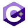

# Elegido Codes

## About Me

I'm a **software engineering**, **web developer**, **web designer**, and **3D animator** focused on creating good quality software products, and **innovative**, **modern** and **optimized** web applications.

## Statics

### My GitHub Stats

### Most Used Languages

**Note:** most used languages is only a metric of the languages my public code consists of and doesn't reflect experience or skill level.

### Programming Languages, SDKs, Preprocessor, and Run Time Environment

 

**Programming languages...** All I have to say is that I had to get in contact with many programming languages even tough I usually work with back-end technologies like Java and PHP for development. Sometimes because of collage and other times because merely curiosity about how they work. The programming languages which I have more experience with are: **Java**, **PHP**, **JavaScript**, **TypeScript**, and **Python**.

I also have experience in designing web applications using modern **Html5**, **Css3**, **Sass**, and **AJAX** techniques. **The result:** **modern**, **optimized**, and **responsive web apps**.

 

### Frameworks, DBMS, Package Managers, and VCS

 

For frameworks I mainly work with Spring Framework, Spring Boot and Hibernate. However, I have also been in contact with frond-end frameworks and libraries like Angular and React. Right now I am more focused in **back-end development**, so I have more experience with Spring, Laravel and Express. 

 

### 3D Modelling and Game Development

 

I usually do 3D modelling using Blender in my free time and some game development either with Unity or Unreal Engine. I have to mention that **I'm not a professional in game development**, but just an amateur who likes to work with graphics and all that stuff. 

 

### Most Common IDEs and Code Editors

 

I do use many IDEs and Code Editors for my daily work, but right now the most frequent ones are: VS Code, Apache NetBeans, Eclipse, JetBrains IDEs, Android Studio, Visual Studio, Blend for Visual Studio, Embarcadero Dev C++, Code::Blogs, and occasionally the Notepad, Notepad++.  

 

## Course I've Taken and I Recommend

 

Throughout these years, I have taken many programming, computer science, and software engineering courses either in collage and online. So, if your interested in learning programming, I recommend the ones from instructors like [Chad Darby](https://github.com/darbyluv2code), [Angela Yu](https://github.com/angelabauer), [Maximilian Schwarzmüller](https://github.com/mschwarzmueller), and [Jonas Schmedtmann](https://github.com/jonasschmedtmann). Their courses are pretty much complete, and there are also theoretical lectures that helped me to understand why things work the way they do, and gave me a solid foundation about computer science and software engineering topics.

