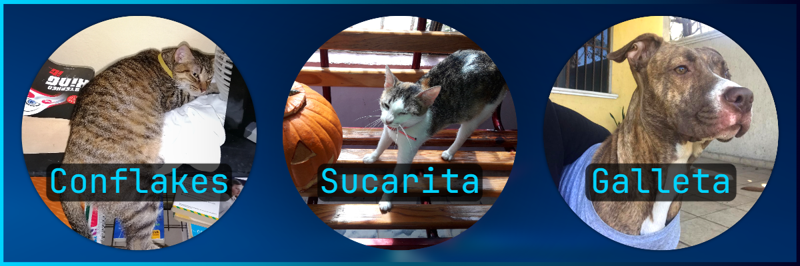

# Elegido Codes

## About Me

I'm a **software engineering**, **web developer**, **web designer**, and **3D animator** focused on creating good quality software products, and **innovative**, **modern** and **optimized** web applications.

## Statics

### My GitHub Stats

### Most Used Languages

Note. Most used languages is only a metric of the languages my public code consists of and doesn't reflect experience or skill level.

## Course I've Taken and I Recommend

